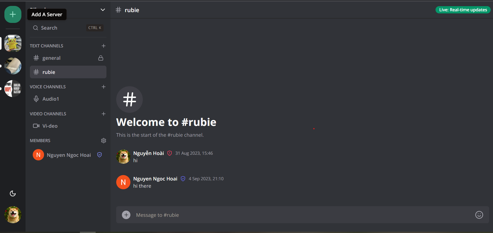
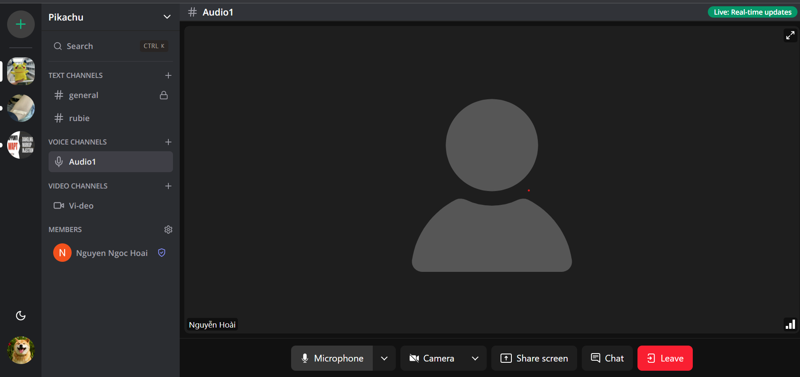
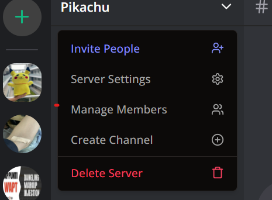
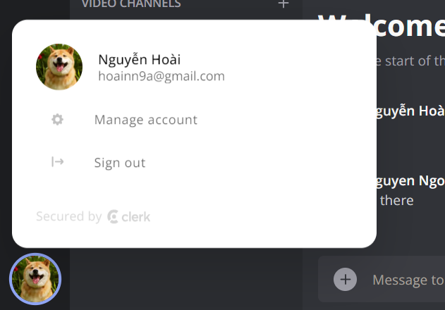

# Rubiecord with real-time messages, similar to Discord

## With features: 
- Real-time messaging using Socket.io
- Send attachments as messages using UploadThing
- Delete & Edit messages in real time for all users
- Create Text, Audio and Video call Channels
- 1:1 conversation between members
- 1:1 video calls between members

- Member management (Kick, Role change Guest / Moderator)

- Unique invite link generation & full working invite system
- Infinite loading for messages in batches of 10 (tanstack/query)
- Server creation and customization
- Beautiful UI using TailwindCSS and ShadcnUI
- Full responsivity and mobile UI
- Light / Dark mode
- Websocket fallback: Polling with alerts
- ORM using Prisma
- MySQL database
- Authentication with Clerk
